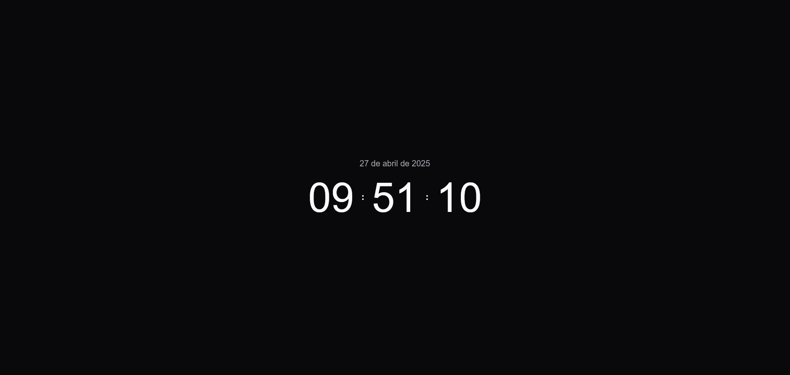

# 🕑 Relógio Digital
Projeto de relógio digital moderno e responsivo usando **HTML**, **CSS** e **JavaScript**. 

## 🔥 Introdução
Projeto desenvolvido com o objetivo de praticar os **fundamentos do JS** e aplicar os conhecimentos de **Dates**.

## ✨ Funcionalidades
- ⏰ Atualização automática da hora (HH:MM:SS)
- 📅 Data formatada em português: "26 de abril de 2025"
- 🌙 Dark Mode automático (18h às 5h ou conforme o tema do dispositivo)
- ✨ Efeito de transição suave ao atualizar os valores
- ⚡ Performance otimizada: apenas muda o texto se houver diferença
- 📱 Responsivo para desktop e mobile


## 📦 Tecnologias usadas
- HTML5
- CSS3 (estilização, transições e dark mode)
- JavaScript (manipulação de DOM e controle de data/hora)

## 📸 Preview


🔗 [Link da Demo](https://relogio-digital-devtatyane.vercel.app/)


## 📂 Estrutura do projeto

```
relogio-digital/
├── src/
│   ├──  images/
│   │    └── preview.png
│   ├── scripts/
│   │   └── index.js
│   └── styles/
│       └── style.css
├── index.html
└── README.md
```

## 🚀 Como rodar o projeto

1. Clone o repositório:
```bash
git clone https://github.com/tatyanepgoncalves/relogio-digital
```

2. Acesse a pasta de projeto
```bash
cd relogio-digital
```

3. Abra o arquivo `index.html` no navegador.
Ou use uma extensão tipo Live Server no VS Code para facilitar.

## 🧠 Melhorias futuras
- 🔮 Relógio 12h / 24h (configurável por botão).
- 📅 Dia da semana junto da data (ex: "Sábado, 26 de abril de 2025").
- 🌍 Suporte a múltiplos idiomas (pt-BR, en-US, etc).
- 🖼️ Background dinâmico (imagem muda de acordo com o horário).
- 📱 Responsividade total (bonito no PC e no celular).
- 🎨 Troca manual de tema (usuário escolhe claro/escuro no botão).
- 🔋 Performance otimizada usando requestAnimationFrame em vez de setInterval (avançado, mas seria top).


## 🙋‍♀️ Autora
Feito com 💜 por Tatyane Gonçalves